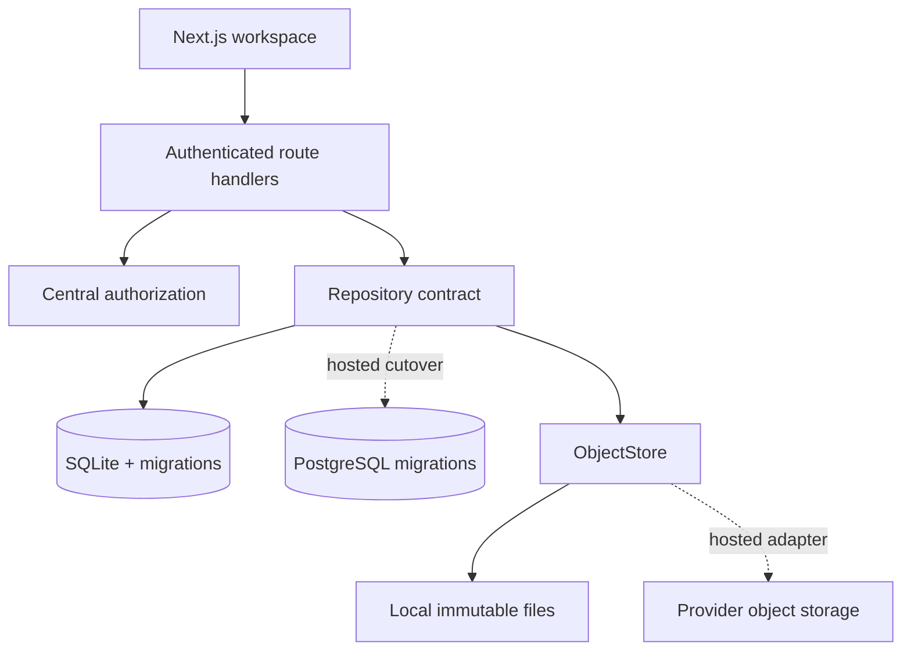
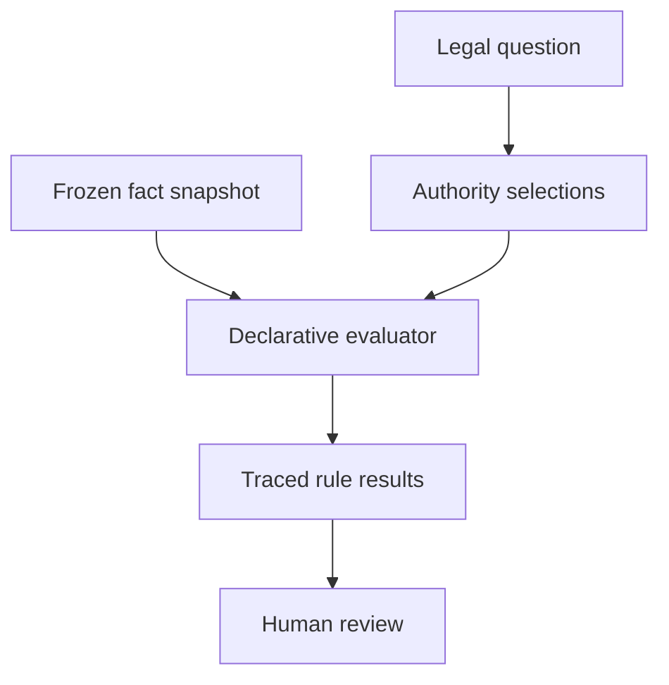

# Interlocks architecture

## Governing rule

If the system knows a fact, it records the fact and its provenance. If it derives an inference, it records the inference, evidence, corpus revision, and time. Changed evidence creates a new inference; it never rewrites the old one. If judgment is required, Interlocks asks a human. Uncertainty is never converted into arithmetic.

## Identity and tenant boundary

- **Person** is the durable human domain identity.
- **Account** is a login-capable record linked to a Person.
- **AuthIdentity** links an external provider subject to an Account; WorkOS can be replaced without changing the domain identity.
- **Workspace** is the tenant/security boundary.
- **Membership** connects a Person and optional Account to one Workspace.
- **WorkspaceRole** grants MEMBER, REVIEWER, or FIRMADMIN authority only inside that membership.
- **SUPERADMIN** is an explicit platform role. Cross-workspace views are reasoned, read-only view-as sessions and every use is audited.

Authorization is centralized in `lib/auth/authorization.mjs`; routes provide the actor, action, resource, and workspace rather than replicating role logic in the interface.

## Knowledge and judgment

| Record | Meaning | Mutability |
|---|---|---|
| Document | Immutable source bytes and metadata | Superseded, never overwritten |
| Assertion | Attributable recorded fact or claim | Superseded, never rewritten |
| Inference | Point-in-time system conclusion from evidence | Immutable |
| Conflict hit | Explainable deterministic match | Snapshot at a corpus revision |
| Policy question | The legal question and selected authority posture | Immutable within its check |
| Policy evaluation | Pack version, frozen facts, hash, trace, and result counts | Immutable |
| Policy rule result | Match, nonmatch, or uncertainty with exact source citation | Immutable |
| Workflow state | Required action: GREEN, YELLOW, RED | Derived from current operational facts |
| Human determination | Professional disposition and rationale | New records supersede old records |
| Consent / screen | Evidence-bearing legal workflow objects | Status history retained |
| Audit event | Actor, authority, scope, action, before/after | Append-only |

Consent never clears a conflict automatically. A screen never becomes a machine cure. Their sufficiency remains a human determination.

## Runtime boundaries

SQLite is the complete local adapter. PostgreSQL-native ordered migrations and connection/migration code are present; aggregate operations remain isolated behind the repository contract for a hosted adapter cutover. Object bytes are addressed through `ObjectStore`, never through UI or route-specific filesystem calls.

## Portability

The portable object is the Person-owned professional ledger, subject to its disclosure class and sharing authorization. Workspace matters, client data, documents, notes, determinations, and private relationships remain with the originating tenant. Departure ends membership access and reduces the active seat count without deleting either side's permitted records.

## Jurisdictional policy boundary

The legal model does not encode ABA rules as universal automated outcomes. Each question selects one or more versioned packs as `CONTROLLING`, `POTENTIALLY_APPLICABLE`, or `COMPARATIVE_ONLY`. The ABA pack is permanent provisional/comparative infrastructure and cannot be marked controlling. Tribunal packs compose with licensing-jurisdiction packs; for example, selecting the Delaware Court of Chancery overlay also records Delaware professional-conduct rules as potentially applicable.

Policy evaluation is side-effect-free and non-Turing-complete. It returns `MATCHED`, `NOT_MATCHED`, or `INDETERMINATE`; it never returns “conflict exists.” Exact pack snapshots, source URLs, citations, fact hashes, and traces make historical results reproducible even after later packs are installed. See `policy-engine.md` for the DSL and pack lifecycle, and `legal-ethics-audit.md` for the original ABA-model audit.
