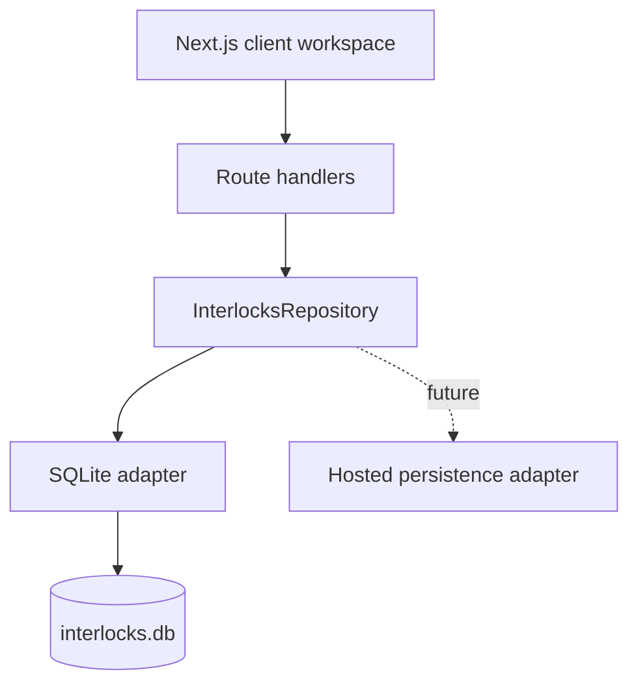

# Interlocks architecture

## Product boundary

Interlocks manages the lifecycle of an organizational conflict concern:

1. A person discloses an external relationship in the context of a matter.
2. The application creates a case and computes an explainable triage score.
3. A reviewer gathers evidence, records notes, and changes the review state.
4. A human records a reasoned outcome: no conflict, manage, recuse, or prohibit.
5. Management controls receive owners and deadlines.
6. Every material action is appended to the audit trail and can be exported.

The risk score orders review work. It is not a legal conclusion or an automated
ethics decision.

## Runtime shape

The UI does not issue SQL or know which adapter is active. Route handlers are
thin transport boundaries. Domain scoring is a pure module. The SQLite adapter
owns schema creation, transactions, relational queries, and append-only audit
events.

## Data model

- **People** are covered employees, reviewers, and administrators.
- **Organizations** are outside parties such as vendors, funders, and partners.
- **Matters** are the specific procurements, research efforts, grants, hiring
  panels, or engagements in which influence may be exercised.
- **Relationships** are disclosed ties between people and outside organizations.
- **Cases** connect a person, relationship, organization, and matter for review.
- **Decisions** record outcomes and rationale; they never overwrite history.
- **Controls** make a management decision operational and accountable.
- **Notes** preserve review evidence and analysis.
- **Audit events** provide an exportable chronology of meaningful actions.

## Persistence boundary

`lib/persistence/interlocks-repository.mjs` defines the replaceable contract.
`SqliteInterlocksRepository` is the local adapter. A future Postgres, D1, or
service-backed adapter must preserve that contract and transaction semantics,
especially the atomic creation of a relationship, case, and audit event.

The database path defaults to `.data/interlocks.db` and may be changed with
`INTERLOCKS_DB_PATH`.

## Security and production work

This prototype intentionally uses a local demonstration identity. A production
implementation should add authenticated identity, organization-scoped access,
role enforcement, field-level confidentiality, retention rules, encrypted
backups, and signed/export-verifiable audit records. Those concerns are kept at
explicit boundaries rather than simulated in the prototype.
